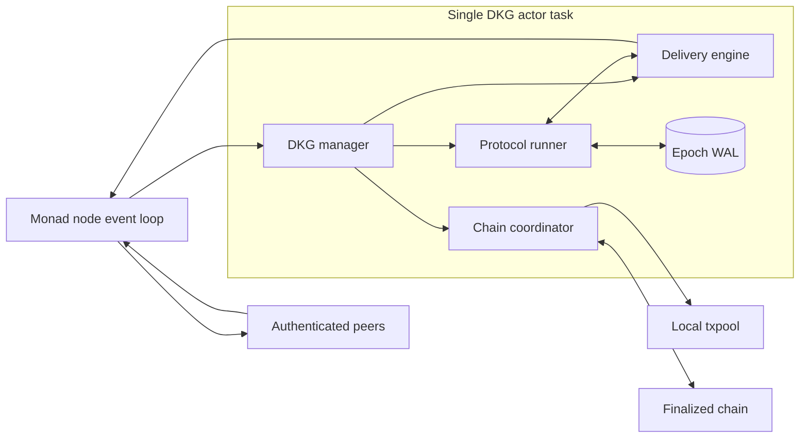
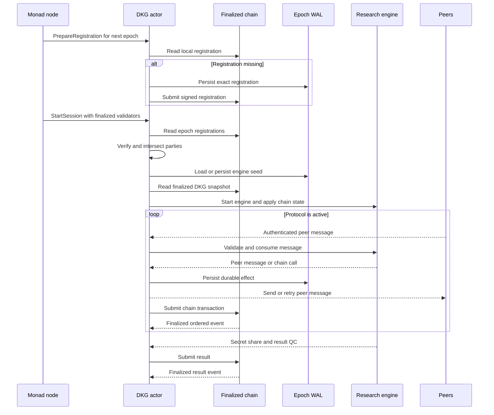
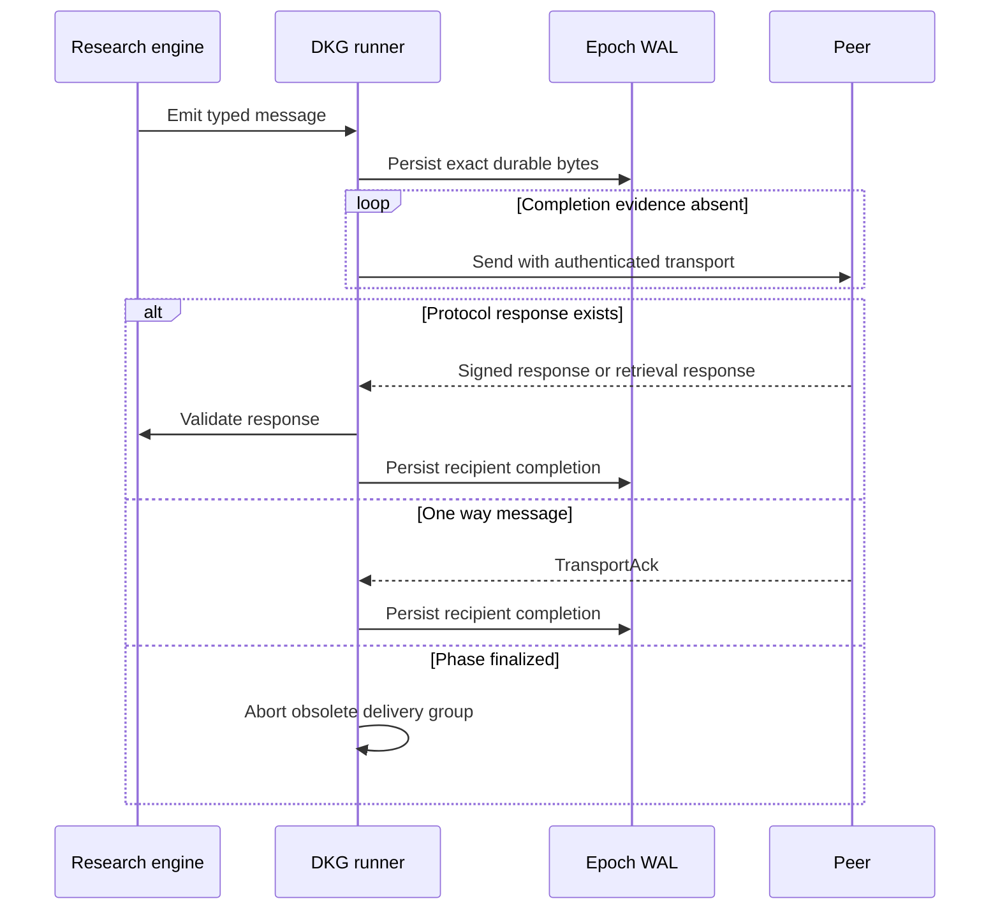
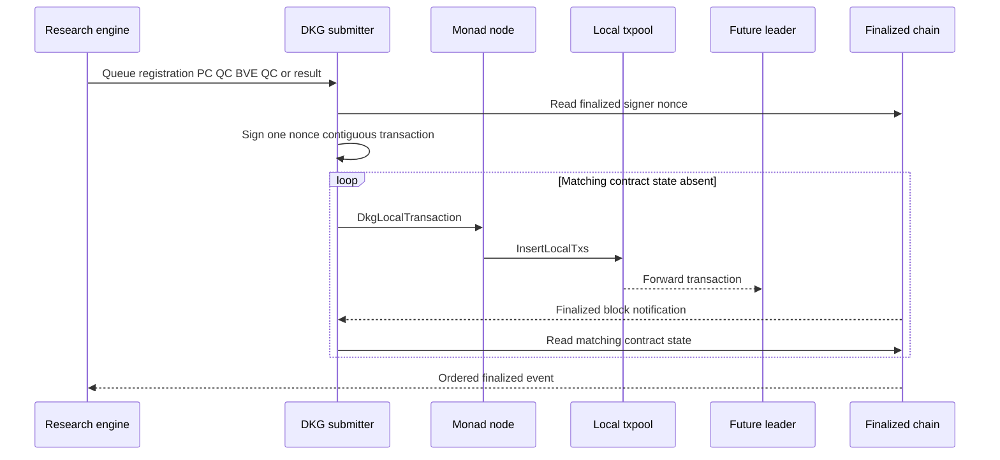
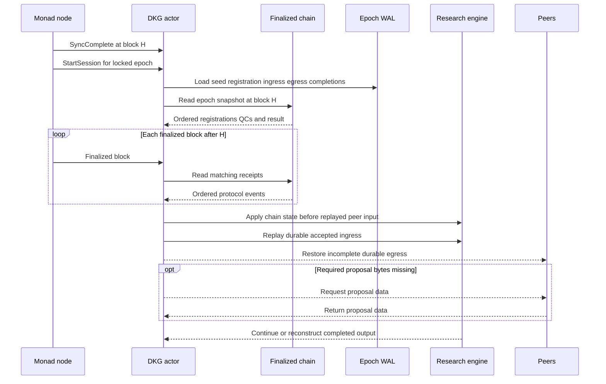

# DKG Integration Summary

This branch adds an epoch-scoped DKG service to `monad-bft`. The service runs
the research DKG engine, reliably exchanges protocol messages, persists the
local transcript needed after a crash, and publishes protocol artifacts through
an on-chain contract.

## Components

| Component | Responsibility | Implementation |
| --- | --- | --- |
| DKG manager | Owns all mutable DKG state and serializes host events, chain I/O completions, protocol effects, and retry timers in one task. It does not spawn helper tasks or threads. | [`manager.rs`](monad-dkg-runner/src/manager.rs) |
| Protocol runner | Adapts registered parties to the research engine, validates peer input, translates typed effects, and reports the final secret share and public result. | [`runner.rs`](monad-dkg-runner/src/protocol/runner.rs), [`engine.rs`](monad-dkg-runner/src/protocol/engine.rs) |
| Delivery engine | Retries per recipient with jittered linear backoff. Application responses stop delivery when available; `TransportAck` is used only for one-way messages. | [`transport.rs`](monad-dkg-runner/src/transport.rs), [`message.rs`](../../category-research-internal/etx-dkg/crates/dkg-protocol/src/message.rs) |
| Chain coordinator | Reads finalized registration and protocol state, orders contract records, and retries one signed transaction at a time until matching finalized state appears. | [`chain`](monad-dkg-runner/src/chain/mod.rs), [`recovery.rs`](monad-dkg-runner/src/chain/recovery.rs), [`submitter.rs`](monad-dkg-runner/src/chain/submitter.rs) |
| Recovery storage | Owns one epoch WAL containing the deterministic seed, exact registration, accepted durable ingress, exact durable egress, and recipient completions. | [`message_store.rs`](monad-dkg-runner/src/storage/message_store.rs), [`record.rs`](monad-dkg-runner/src/storage/record.rs), [`wal.rs`](monad-dkg-runner/src/storage/wal.rs) |
| Production chain adapter | Implements `DkgChain` with local Triedb state reads, bloom-filtered receipt reads, finalized nonces, and a local transaction channel. | [`triedb.rs`](monad-dkg-runner/src/chain/triedb.rs), [`triedb_state.rs`](monad-dkg-runner/src/chain/triedb_state.rs) |

The `DkgChain` trait is the only chain-specific boundary. Chain calls execute
synchronously on the DKG manager task. See
[`chain/mod.rs`](monad-dkg-runner/src/chain/mod.rs) and
[`manager.rs`](monad-dkg-runner/src/manager.rs).

## Normal Flow

Details:

- `monad-node` forwards finalized blocks, validator sets, sync completion, and
  authenticated peer messages through `DkgManagerHandle`. It receives only
  network output and locally signed transactions. See
  [`manager.rs`](monad-dkg-runner/src/manager.rs) and
  [`main.rs`](monad-node/src/main.rs).
- Registration starts during the epoch before the target validator set is
  locked. At the boundary, the manager reads all contract registrations and
  intersects them with the finalized validator set. See
  [`manager.rs`](monad-dkg-runner/src/manager.rs) and
  [`registration.rs`](monad-dkg-runner/src/registration.rs).
- Validator sets still come from the existing staking-state updater. See
  [`triedb_val_set.rs`](monad-updaters/src/triedb_val_set.rs) and
  [`main.rs`](monad-node/src/main.rs).
- The contract accepts registrations only during the epoch before the staking
  boundary. On the first protocol write after the boundary it intersects those
  registrations with staking's locked target validator set, sorts eligible
  addresses ascending, and freezes membership in a compact bitmap;
  `PartyId = sorted eligible-address index` is reconstructed from the now-closed
  registrations. This is the same mapping assembled by the runner and remains
  available after staking rotates its snapshot. See
  [`DkgContract.sol`](dkg-contracts/src/DkgContract.sol) and
  [`registration.rs`](monad-dkg-runner/src/registration.rs).
- The terminal DKG result is not trusted just because a validator submitted it.
  The contract reconstructs the engine session digest from the frozen party
  addresses and registered QC keys, then verifies a
  `2 * floor((N - 1) / 3) + 1` quorum of distinct secp256k1 signatures over the
  exact SHA-256 DKG-DONE statement `(epoch, session_id, g2x)`. Recording that QC
  makes the epoch terminal: later PC and BVE QCs revert. Protocol records retain
  a monotonic epoch sequence and dedicated events. See
  [`DkgContract.sol`](dkg-contracts/src/DkgContract.sol).

## Peer Delivery

Details:

- The research crate returns typed `DkgMessage` values backed by `Bytes` and
  derives and encodes semantic `DkgMessageId` values from protocol fields. See
  [`message.rs`](../../category-research-internal/etx-dkg/crates/dkg-protocol/src/message.rs).
- Incoming data is decoded and validated by the runner before it is persisted
  or acknowledged. Rejected input produces neither a WAL record nor an ACK. See
  [`runner.rs`](monad-dkg-runner/src/protocol/runner.rs).
- A semantic message occupies one store slot. Restart reuses persisted bytes;
  conflicting regenerated bytes are logged and suppressed. Retrieval requests
  are ephemeral and can be regenerated. See
  [`message_store.rs`](monad-dkg-runner/src/storage/message_store.rs).
- Retry delay grows linearly from 2 to 30 seconds and adds randomness from
  `rand`. See [`transport.rs`](monad-dkg-runner/src/transport.rs).

## Chain And Txpool

Details:

- The submitter keeps one active transaction, reuses its exact bytes, retries on
  finalized blocks, and only stops when chain state confirms the artifact. A
  txpool admission status is not a success condition. See
  [`submitter.rs`](monad-dkg-runner/src/chain/submitter.rs).
- `monad-node` converts the local channel item to `InsertLocalTxs`. The normal
  txpool validates it and forwards it to future leaders. See
  [`dkg.rs`](monad-node/src/dkg.rs), [`main.rs`](monad-node/src/main.rs), and
  [`executor`](monad-eth-txpool-executor/src/lib.rs).
- Proposal selection recognizes the configured DKG contract and limits DKG
  transactions per signer. There is no separate foreign-DKG ingestion path.
  See [`transaction.rs`](monad-eth-txpool/src/pool/transaction.rs) and
  [`sequencer.rs`](monad-eth-txpool/src/pool/sequencer.rs).

## Restart Recovery

Details:

- Chain events and scan cursors are not persisted. Finalized contract state is
  read once at the sync watermark, then each later finalized block is scanned
  exactly once by the manager cursor. See
  [`recovery.rs`](monad-dkg-runner/src/chain/recovery.rs).
- The WAL is `dkg-recovery-<epoch>.wal`. It uses checksummed typed records,
  Linux `fallocate`, flush-before-send ordering, and torn-tail truncation. It is
  owned only by `DkgMessageStore`; there is no separate completed-output file.
  See [`record.rs`](monad-dkg-runner/src/storage/record.rs) and
  [`wal.rs`](monad-dkg-runner/src/storage/wal.rs).
- The chain restores public QCs and final result. The WAL restores the local
  deterministic transcript required to reconstruct the private share. See
  [`runner.rs`](monad-dkg-runner/src/protocol/runner.rs).
